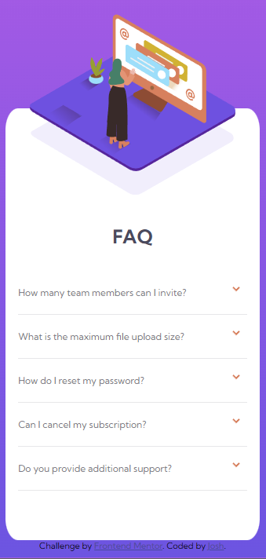

# Frontend Mentor - FAQ accordion card solution

This is a solution to the [FAQ accordion card challenge on Frontend Mentor](https://www.frontendmentor.io/challenges/faq-accordion-card-XlyjD0Oam). Frontend Mentor challenges help you improve your coding skills by building realistic projects. 

## Table of contents

- [Overview](#overview)
  - [The challenge](#the-challenge)
  - [Screenshot](#screenshot)
  - [Links](#links)
- [My process](#my-process)
  - [Built with](#built-with)
  - [What I learned](#what-i-learned)
  - [Continued development](#continued-development)
- [Author](#author)

## Overview

### The challenge

Users should be able to:

- View the optimal layout for the component depending on their device's screen size
- See hover states for all interactive elements on the page
- Hide/Show the answer to a question when the question is clicked

### Screenshot

### Links

- Solution URL: [https://github.com/joshlitam/faq]
- Live Site URL: [https://joshlitam.github.io/faq/]

## My process

### Built with

- Semantic HTML5 markup
- CSS custom properties
- Flexbox

### What I learned

I learned to use media breakpoints to change the layout based on the viewport. I also learned how to use and resize background images, as well as use the details tag in html.

### Continued development

Continued development and improvement for this solution includes making it responsive for all sizes of viewports, not only the specified ones.

## Author

- Website - [josh](https://github.com/joshlitam)
- Frontend Mentor - [@josh](https://www.frontendmentor.io/profile/joshlitam)